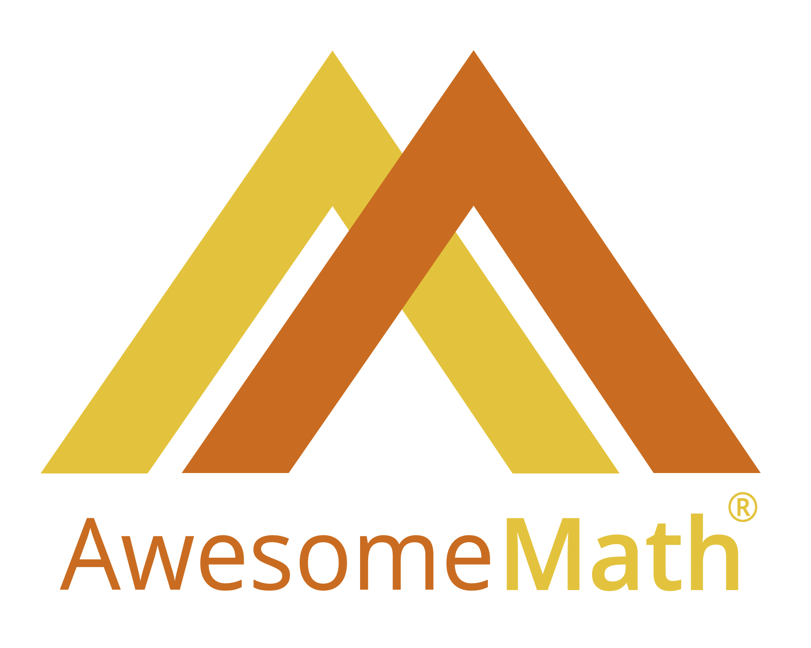

## 13th Utah Math Olympiad

We are pleased to announce the 13th Utah Math Olympiad, which will be held on **Saturday, March 29, 2025 from 1-4pm** at the [Waterford School](https://waterfordschool.org/). You may [view the flyer](/doc/2025-umo-flyer.pdf) or register below:

<a class="registerlink" href="https://docs.google.com/forms/d/e/1FAIpQLSdU0Zd8xxpxN40dydrKbCg3RnG0uT7QmcFSq30bkXGy8kb6tQ/viewform?usp=dialog">REGISTER HERE</a>

<!--
The 12th Utah Math Olympiad has concluded. The [results](results/2024) are now available!

You may also check out the [problems and solutions](problems/) for this and all past contests.
-->

## Supporters of the UMO

We are grateful for support including prizes for this year's contest from [AwesomeMath](https://awesomemath.org/).

## Contact Us

Please get in touch with us at: [{{site.author_email}}](mailto:{{site.author_email}})

If you would like to be notified of details of future contests, sign up for our [contact list](https://forms.gle/64Ns5xXmiR6GHraJ7). We send only a few emails a year.
