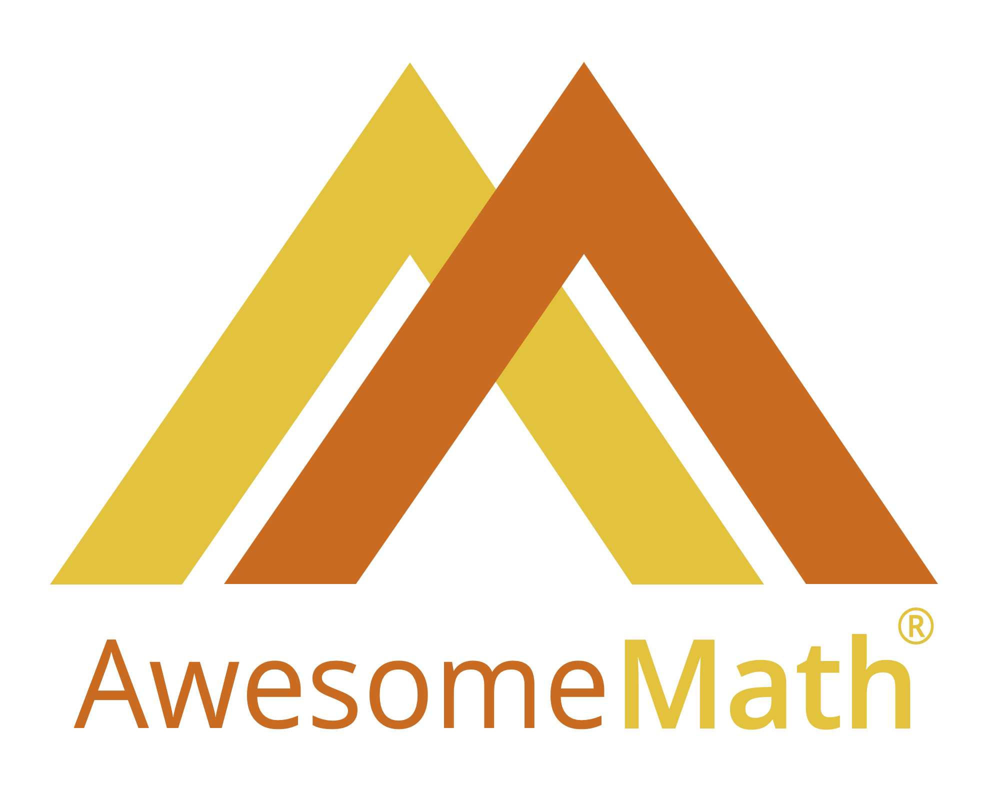

Congratulations to all the participants in the 2025 Utah Math Olympiad. We especially congratulate the top 11 places in the state of Utah:

| Rank | Name | Score | School | Grade | Prize |
| --- | --- | --- | --- | --- | --- |
| 1 | Liam Reddy | 39 | Waterford School | 11 | $125
| 2 | Kiran Reddy | 34 | Waterford School | 12 | $105
| 3 | Jonathan Wu | 22 | Waterford School | 8 | $60
| 4 | Kevin Ying | 20 | Skyline High School | 10 | $50
| 5 | Aashita Mandiwal | 18 | West High School | 8 | $40
| 5 | Tanish Shetty | 18 | West High School | 9 | $40
| 7 | Frederick Pau | 16 | West High School | 8 |
| 7 | Wilson St. Martin | 16 | Hillcrest High School | 11 |
| 9 | Fiona Jiang | 13 | Waterford School | 11 |
| 10 | Beckett Mickelson | 11 | Maple Mountain High School | 10 |
| 10 | Evan Elkin | 11 | Rowland Hall | 11 |

Additionally, the graders would like to award $20 for the best solution to each of the following problems:

| Problem | Name | School | Grade | Prize |
| --- | --- | --- | --- | --- |
| 1 | Aashita Mandiwal | West High School | 8 | $20 |
| 2 | Tanish Shetty | West High School | 9 | $20 |
| 4 | Kiran Reddy | Waterford School | 12 | $20 |
| 6 | Liam Reddy | Waterford School | 11 | $20 |

The scores of all participants are included in the link below. If you opted to receive scores and comments by email, you should also have received that email. If you cannot remember your ID number, or have any issue receiving your score and comments, please email [{{site.author_email}}](mailto:{{site.author_email}}) using the email that you gave us when you registered for the contest, and we will assist you.

[2025 UMO Scores](/doc/2025UMOscores.pdf)

## Supporters of the UMO

We are grateful for support including prizes for this year's contest from [AwesomeMath](https://awesomemath.org/).

